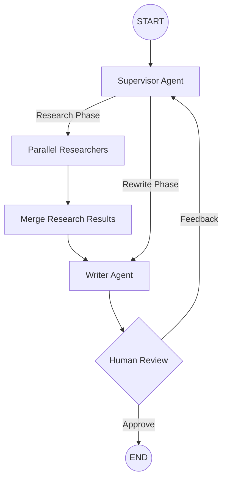

# Multi-Agent Web Research & Document Writer

A LangGraph-based multi-agent system with a Supervisor-led dynamic architecture that researches topics in parallel and creates comprehensive documents.

## Architecture

The system uses a Supervisor agent to orchestrate the research and writing process. Researchers run in parallel to gather information on subtopics, which is then synthesized by a Writer agent. A Human Review step ensures quality before finalization.



## Setup

### 1. Prerequisites
- Python 3.12+
- OpenAI API key

### 2. Installation (WSL/Linux)

```bash
# Clone and enter directory
cd project_demo

# Run setup script (creates venv and installs deps)
chmod +x setup_env.sh
./setup_env.sh

# Activate virtual environment
source venv/bin/activate
```

### 3. Configure Environment

```bash
# Copy example env file
cp .env.example .env

# Edit .env and add your OpenAI API key
# OPENAI_API_KEY=sk-your-key-here
```

## Usage

### Run the Agent

```bash
python main.py
```

The agent will:
1. Initialize the Supervisor to decompose the query.
2. Spawn parallel Researchers for each subtopic.
3. Merge research results.
4. Draft the document.
5. Pause for your review in the terminal.

### Custom Research Query

Edit the `query` variable in `main.py`:

```python
query = """
Research the current state of artificial general intelligence (AGI) development.
Include major labs (OpenAI, DeepMind, Anthropic), breakthroughs, and timelines.
Write a summary document called 'agi_report.md'.
"""
```

## Project Structure

```
project_demo/
├── agents/                 # Multi-agent module
│   ├── base.py            # Abstract base agent
│   ├── researcher.py      # Gathers information
│   ├── supervisor.py      # Orchestrator & Router
│   ├── writer.py          # Creates documents
│   ├── human_review.py    # Human-in-the-loop logic
│   ├── state.py           # Shared agent state
│   └── models.py          # Data models and schemas
├── mcp_servers/           # MCP tool servers (FastMCP)
│   ├── research_server.py # Web search & Wikipedia
│   └── document_server.py # File operations
├── prompts/                # Externalized system prompts
│   ├── supervisor_system.md
│   ├── researcher_system.md
│   └── writer_system.md
├── output/                # Generated research documents
├── main.py                # Graph construction & entry point
├── tools.py               # MCP client & tool aggregation
├── requirements.txt       # Python dependencies
└── setup_env.sh           # Setup utility
```

## Available Tools

### Research Tools
| Tool | Description |
|------|-------------|
| `web_search` | Search the web via DuckDuckGo |
| `fetch_webpage` | Extract content from URLs |
| `wikipedia_search` | Query Wikipedia for summaries |

### Document Tools
| Tool | Description |
|------|-------------|
| `write_document` | Create/overwrite a document in `output/` |
| `read_document` | Read document contents |
| `append_to_document` | Append to existing document |
| `list_documents` | List all documents in `output/` |

## Output

Generated documents are saved to the `output/` directory by default.
